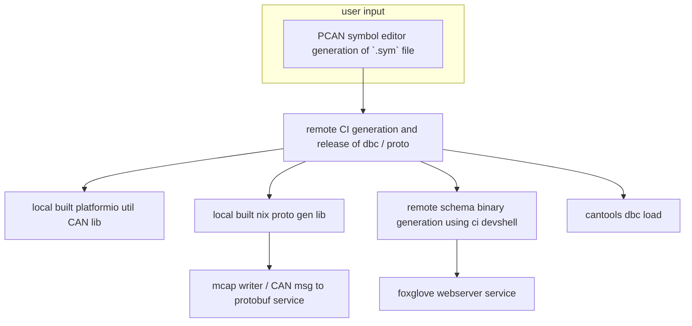
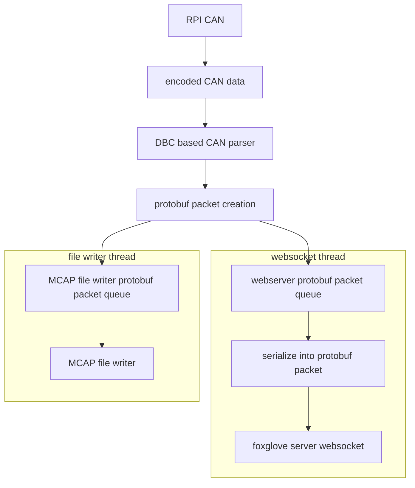

# Base person usage:
1. Download foxglove studio at https://github.com/foxglove/studio/releases 
2. Connect to the Pi's network (KS7E)
3. Open foxglove studio 
4. Open a connection to the Pi's IP (192.168.1.7) on port 8765 
5. Look at data

# dev usage: 

to get into a dev environment locally (on linux):
1. install nix:

```bash
sh <(curl -L https://nixos.org/nix/install) --daemon
```

2. enable flakes:
Add the following to `~/.config/nix/nix.conf` or `/etc/nix/nix.conf`:

```
experimental-features = nix-command flakes
```

3. run `nix develop` to enter dev shell

4. (optional) run upv.sh to start the virtual CAN-dapter for testing things or up.sh if you have an actual CAN-dapter plugged in

5. run `runner.py` for the local usb to CAN listener on host machine


usage notes:
- update to newest DBC:

`nix flake lock --update-input can_pkg_flake`

TODO:
- [ ] Update this readme with a new list of goals



## high level overview
input: 
- CAN -> protobuf stream

output: 
- saved files at time steps
- encoded websocket stream of data
- desired behavior for the data flow:
    - on hardware receive in the data_handler script data gets pushed into a container triggers both the webserver and the data writer to use that data
    - once both the data writer and the foxglove websocket have finished processing the data delete the data from the container
- a desired workflow is that it all we need to do to add a new input that we will be seeing over the wire is to add a .proto to a specific folder. No code changes should be required.


